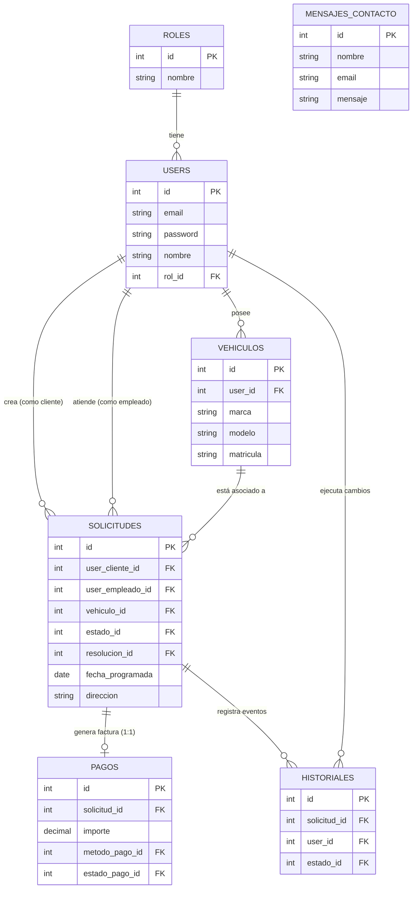

# Documentación del Proyecto TFG: CAR-HERO

## 1. Autor del Proyecto
**Autor/a**: Jose Carlos Ruiz Frias

## 2. Título y Temática
**Título**: CAR-HERO — Gestión de recogida de vehículos para ITV  
**Temática**: Aplicación web integral para la gestión completa y trazabilidad en el servicio de recogida, traslado y devolución de vehículos de clientes para realizar la inspección técnica (ITV).

## 3. Objetivos/Descripción
**CAR-HERO** nace para digitalizar y optimizar la operativa de flotas o talleres que ofrecen el servicio de traslado de vehículos para superar la ITV. El sistema coordina las peticiones de los clientes, asigna empleados como conductores, realiza el control de estado y ubicaciones, y gestiona los pagos, ofreciendo una experiencia centralizada, transparente y eficiente.

## 4. Funcionalidades
La plataforma cubre todos los requisitos del ciclo de vida del servicio basándose en un sistema de **Roles (Cliente, Empleado, Administrador)**.

- **Vistas Estáticas**: Landing Page / Contacto (`Contacto.tsx`), Pantallas de Autenticación (`Login.tsx`, `Register.tsx` incluyendo integración con Google OAuth).
- **Vistas Dinámicas**: 
  - **Dashboard/Panel de control (`Dashboard.tsx`)**: Estadísticas interactivas y contadores filtrados por rol.
  - **Página de Perfil (`Perfil.tsx`)**: Configuración de usuario e imagen de perfil.
  - **Detalle de la Solicitud (`SolicitudDetail.tsx`)**: Estado de seguimiento con interacciones para avanzar el flujo, cancelar servicio o registrar pagos.
  - **Detalle de Vehículo (`VehiculoDetail.tsx`)**: Historial relacionado al vehículo.
- **Vistas CRUD de Mantenimiento (Tablas Dinámicas)**:
  - `Usuarios` (`Users.tsx`): Altas, bajas, modificaciones, y gestión de roles.
  - `Vehículos` (`Vehiculos.tsx`): Gestión del garaje del cliente.
  - `Solicitudes` (`Solicitudes.tsx`): Central de reservas.
  - `Pagos` (`Pagos.tsx`): Historial transaccional.
  - `Historial` (`Historial.tsx`): Bitácora de auditoría de los cambios de estado.
  - `Mensajes` (`Mensajes.tsx`): Formulario público de correo.

## 5. Arquitectura / Tecnología
El sistema emplea un stack moderno separado en cliente, servidor y contenedores, posibilitando despliegues ágiles.

- **Frontend**: Desarrollado con **React**, mediante **Vite**. Se usa **TypeScript** como tipado fuerte. La interfaz interactiva se crea usando **Tailwind CSS 4** colaborando estéticamente con componentes modulares de **shadcn/ui** y la iconografía de **Lucide React**. El enrutamiento se maneja con **React Router DOM**. Gráficos realizados con **Recharts**.
- **Backend**: Servidor RESTful construido con **Laravel 12 (PHP 8.2)**. Las peticiones son atendidas en una API expuesta en `routes/api.php`.
- **Base de Datos**: Relacional usando **MySQL 8.0** y comunicada por el ORM oficial de Laravel (**Eloquent**).
- **Despliegue**: Se usa **Docker y Docker Compose**. Un solo archivo levanta y orquesta cuatro contenedores principales de forma automatizada: `frontend`, `backend`, `db` (MySQL) y `phpmyadmin` (para control administrativo).

*(Este apartado se mantendrá vivo, actualizando librerías tipo `React Hook Form`, `Zod`, o `Sanctum` si su uso adquiere gran envergadura documental)*.

## 6. Esquema Entidad-Relación (Base de Datos)
La arquitectura de datos de base relacional se sostiene bajo las siguientes entidades:

- **Users**: Mantiene las credenciales, rol (foreign key a entidad Roles) y token para inicio de sesión.
- **Roles**: Tipifica a los usuarios (Cliente, Empleado, Administrador).
- **Vehiculos**: Relacionado 1:N con Users (un usuario puede tener varios vehículos). Contiene matrícula, marca, modelo e imagen.
- **Solicitudes**: Núcleo del sistema. Referencia al `cliente_id` (User), `empleado_id` (User al que se le asigna), y `vehiculo_id`. Controla la fecha y ubicación geográfica del recojo.
- **Estados / EstadoPago / Resolucion**: Tablas de referencia para mapear dinámicamente si el coche está "Pendiente", "En Camino", si el pago fue "Exitoso" o "Fallo" y si la ITV fue "Favorable" o "Desfavorable".
- **Pagos**: Asociados 1:1 a la Solicitud. Mantiene el importe total transaccionado y referencias al modo de pago.
- **Historial**: Tabla pivote/auditora. Toda interacción en una `Solicitud` dispara un insert en Historial documentando ¿quién? (User), y el nuevo "Estado".
- **MensajeContacto**: Buzón aislado de la plataforma de registro con nombre y correo para landing.

### Diagrama Entidad-Relación

## 7. Revisión (Checkpoint)
- **Frecuencia**: [Especificar aquí si será "Cada 15 días" o "Semanal"].
- Las revisiones constarán en testear las funcionalidades de las historias de usuario de los últimos sprints contra el prototipo original.

## 8. Entrega del Proyecto
Todo el desarrollo, manuales, y justificaciones de diseño estarán permanentemente alojados en el repositorio de **GitHub**. De manera idéntica al anteproyecto, el formato de todo el material documental está integrado acá en **la Wiki de los repositorios**, simplificando revisiones para los evaluadores.

## 9. Instalación y Prerrequisitos
- **Prerrequisitos**: Docker y Docker Compose, manejador de terminal (Git Bash, WSL, o PowerShell).
**Pasos**:
1. Clonar repositorio.
2. Hacer una copia de los archivos de variables de entorno `.env.example` hacia `.env` respectivamente.
3. Ejecutar contenedores: `docker compose up -d --build`.
4. Instalar y aprovisionar BD: 
   `docker exec -it carhero_backend bash` -> `php artisan migrate --seed` -> `php artisan key:generate`.
5. Acceder vía: Backend (`localhost:8000`), Frontend (`localhost:5173`), DBMyAdmin (`localhost:8081`).

## 10. Manual de Usuario
- **Formato Video**: [Vínculo YouTube pendiente de grabar en fase de producción]
- **Formato Texto**: [Enlace en formato Wiki con capturas de pantalla de uso pendiente en fase final]

## 11. Prototipado Figma
- **Enlace Figma**: [Pegar aquí el vínculo de Alta Fidelidad del diseño UI/UX]

## 12. Documentación Técnica
Se han implantado librerías especializadas para lidiar con el nivel de abstracción demandado por las interfaces responsivas:
- **Axios**: Estructuración del interceptor HTTP que envía el Bearer Token automáticamente en cada petición REST.
- **Tailwind CSS + shadcn/ui**: Se centralizaron todas las primitivas y variables de accesibilidad del DOM en estilización, implementando componentes reusables altamente personalizables.
- **React Hook Form + Zod**: Responsable de la abstracción del DOM en formularios. Aporta validación síncrona/asíncrona estricta del lado del cliente.
- **Laravel Sanctum / Resend**: Empleados en backend para el API Shield de autenticaciones ligeras y distribución real de correos electrónicos.

## 13. Escalabilidad / Reusabilidad
El sistema fue ideado implementando el concepto de "Code Quality Control" buscando DRY (Don't Repeat Yourself):
- **Botones y Tablas Reusables**: Se ha creado un ecosistema UI desde componentes modulares tipo. Cualquier "Input" o "Dashboard Table" carga variables y colores dinámicamente según prop.
- **Variables de Entorno Centralizadas**: Tanto `VITE_API_URL` por el cliente como las conexiones de BD del servidor residen en ficheros `.env` encriptados que garantizan que el código no requiera compilaciones extra para cambiar de servidores en un futuro.
- **Autorización por Políticas**: Laravel `Policies` blindan toda entrada, un cambio de derechos de empleado actuará globalmente sin rastrear controladores sueltos.

## 14. Arquitectura de Ficheros
- **/frontend**: 
  - `src/pages/`: Pincelada gruesa. Páginas completas a las que el router llama.
  - `src/components/`: Piezas de "puzle" (botones, cards, tablas) modulares que se combinan en las views.
  - `src/context/`: Elementos del React Context para mantener estados de usuario.
- **/backend**:
  - `app/Models/` & `app/Http/Controllers/`: Implementan el núcleo MVC que empalma con la BD.
  - `routes/api.php`: Switchboard de entrada que determina los dominios de la API.

## 15. Aspectos Técnicos Destacables
- **Centralización de los endpoints**: Usando Axios se establecieron prefijos baseURL. Ante un cambio de IP, se cambia en un solo string en las variables de entorno.
- **Niveles de Persistencia**: El token de validación es persistido en localStorage manteniéndolo intacto en refrescos de pantalla, mientras que los datos de listajes se obtienen en el montaje, confiando fielmente en la base de datos real. *(Nota de seguridad: Se ha configurado una caducidad del token en el backend a 12 horas para garantizar que sesiones inactivas expiren de forma segura, adaptándose así a la jornada laboral de un empleado).*
- **Fetching Data**: React en sus ciclos de vida consume los endpoints para garantizar consistencia. Todos los filtros delegados en el CRUD son aplicados via Base de Datos (en el servidor de DB) para estar siempre actualizados.
- **Autenticación**: Proceso de **Token**. En Laravel, se despacha por Sanctum; el cliente lo captura y lo embebe en las posteriores autorizaciones Bearer.
- **Gestión de Imágenes**: Procesamiento a sistema de ficheros local. Laravel guarda las fotos y procesa recursos de usuarios emitiendo URLs relacionales.
## 16. Bitácora del TFG
El proceso ha sido documentado adoptando metodología estructurada, dejando constancia de múltiples incidencias y bloqueos técnicos. Algunos ejemplos de los procesos documentados son:
- **Caducidad del Token**: Se analizó la persistencia indefinida que concedía Sanctum por defecto y se tomó la decisión técnica de modificar `config/sanctum.php` fijando expiración a 720 minutos (12h). Esto protege el sistema ante posibles extravíos de móviles del personal pero mantiene usabilidad al no requerir logueos dentro del turno.
- **Conflictos de Políticas CORS**: Al plantear una arquitectura desacoplada bajo Docker (frontend en puerto 5173 y backend en 8000), el navegador bloqueaba las llamadas Axios. Se solucionó configurando explícitamente el guard `stateful` de Sanctum y los orígenes permitidos en el middleware del servidor.
- **Control de Flujo por Roles (Frontend y Backend)**: Se planteó cómo evitar accesos indebidos. En el cliente se resolvió mediante Guards en React Router DOM bloqueando Vistas si no se poseía el rol necesario, y por seguridad, esto se apoyó estrictamente con validaciones `FormRequests` y `Policies` en Laravel en el servidor para evitar burlas de red.
- **Optimización de Interfaz en Formularios Asíncronos**: Formularios masivos como `SolicitudDetail` y `NuevoVehiculo` presentaban cuellos de botella por exceso de renderizaciones. La refactorización incluyó el uso integral de **React Hook Form combinado con Zod**, mejorando drásticamente la UX con feedback sincrónico y ahorrando llamadas innecesarias al backend.

## 17. Mejoras / Propuestas Futuras
- **WebSockets / Notificaciones Push**: Integrar herramientas como Laravel Reverb o Pusher para transmitir notificaciones y ubicaciones GPS en tiempo real sobre el viaje en progreso del vehículo directamente a la pantalla del cliente.
- **Pasarela de Pago Bancaria**: Evolucionar la validación manual de pagos a una integración automatizada y segura en el frontend con pasarelas como `Stripe` o `Redsys` mediante webhooks y tarjeta de crédito.
- **Soporte PWA (Progressive Web App) y Modo Offline**: Transformar el frontend de Vite/React instalando *Service Workers* para que los Empleados puedan seguir operando la aplicación en zonas de mala cobertura móvil (ej. descargar listados de solicitudes en garajes subterráneos sin red) y sincronizar los estados asíncronamente con el Backend una vez recuperada la conexión.
- **Emisión Automática de Facturas PDF**: Configurar integraciones como DomPDF en el backend para generar documentos imprimibles legales de forma automatizada y utilizar las *Colas de Laravel (Queues)* para despacharlos en segundo plano al correo del cliente mediante Resend, salvaguardando los tiempos de respuesta de la API.
- **Internacionalización Dinámica (i18n)**: Implementar librerías de traducción nativas en React (ej. `react-i18next`) para escalar el radio de acción del producto a extranjeros residentes abriendo el soporte de la web en distintos idiomas sin tener que duplicar componentes.

## 18. Bibliografía
- *Laravel 12.x Official Documentation* - https://laravel.com/docs/12.x
- *React Dev Documentation* - https://react.dev/
- *Tailwind CSS Documentation* - https://tailwindcss.com/docs
- *Docker Docs & Compose Reference* - https://docs.docker.com/
- *Vite (Next Generation Frontend Tooling)* - https://vitejs.dev/
- *shadcn/ui (UI Components)* - https://ui.shadcn.com/
- *React Router (Declarative Routing)* - https://reactrouter.com/
- *React Hook Form* - https://react-hook-form.com/
- *Zod (TypeScript-first schema validation)* - https://zod.dev/
- *MySQL 8.0 Reference Manual* - https://dev.mysql.com/doc/refman/8.0/en/
- *Resend (Email API for Developers)* - https://resend.com/docs
- *Recharts (Composable Charting Library)* - https://recharts.org/
- *Radix UI (Unstyled, accessible DOM primitives)* - https://www.radix-ui.com/
- *Lucide (Icons)* - https://lucide.dev/
