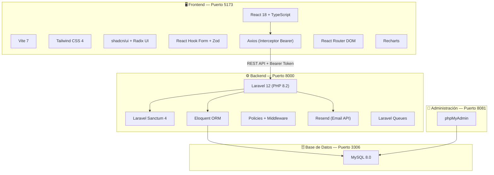
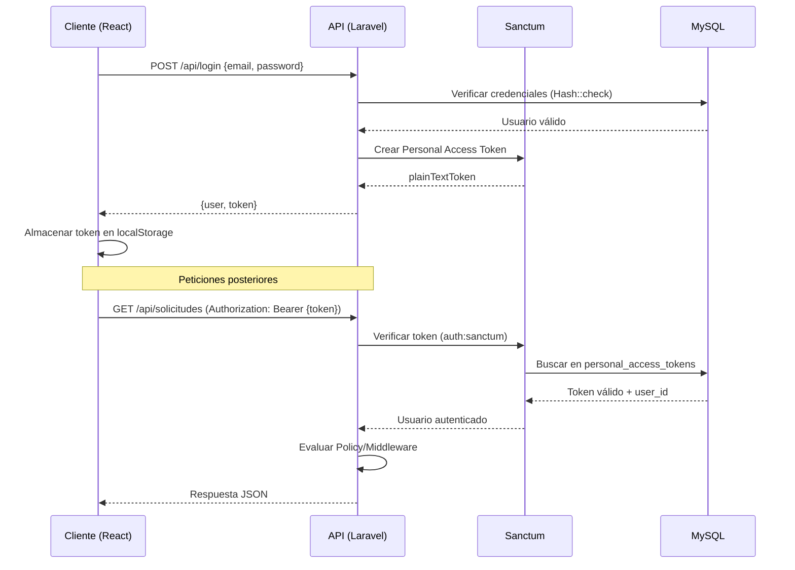
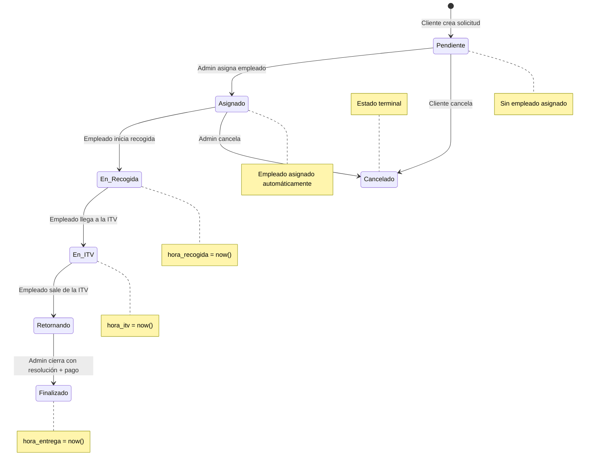
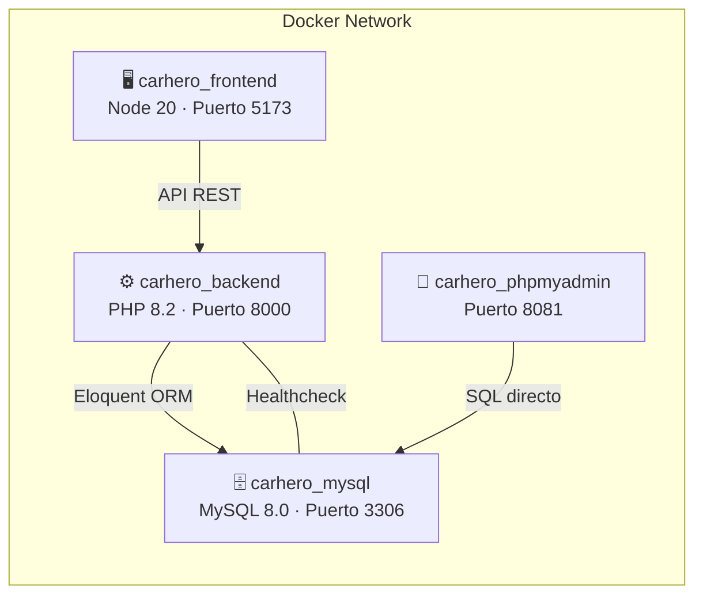
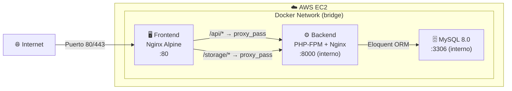

# Documentación del Proyecto TFG: CAR-HERO

---

## 1. Autor del Proyecto

**Autor**: Jose Carlos Ruiz Frias

---

## 2. Título y Temática

**Título**: CAR-HERO — Gestión de recogida de vehículos para ITV  
**Temática**: Aplicación web integral para la gestión completa y trazabilidad en el servicio de recogida, traslado y devolución de vehículos de clientes para realizar la inspección técnica (ITV).

---

## 3. Objetivos / Descripción

**CAR-HERO** nace para digitalizar y optimizar la operativa de flotas o talleres que ofrecen el servicio de traslado de vehículos para superar la ITV. El sistema coordina las peticiones de los clientes, asigna empleados como conductores, realiza el control de estado y ubicaciones, y gestiona los pagos, ofreciendo una experiencia centralizada, transparente y eficiente.

### Objetivos principales

| Objetivo | Descripción |
|---|---|
| **Digitalización del flujo** | Sustituir la gestión manual de solicitudes por un sistema web trazable |
| **Control de roles** | Diferenciar las capacidades de cada actor (Cliente, Empleado, Administrador) |
| **Trazabilidad total** | Registrar cada cambio de estado, hora y resolución en un historial auditable |
| **Gestión de pagos** | Vincular cada solicitud finalizada a un registro de pago verificable |
| **Despliegue ágil** | Orquestar toda la infraestructura con un solo comando de Docker Compose |

---

## 4. Funcionalidades

La plataforma cubre todos los requisitos del ciclo de vida del servicio basándose en un sistema de **Roles (Cliente, Empleado, Administrador)**.

### 4.1 Vistas Estáticas (Públicas)

| Pantalla | Fichero | Descripción |
|---|---|---|
| Landing / Contacto | `Contacto.tsx` | Formulario público de contacto con protección anti-spam **Cloudflare Turnstile**. Envía el mensaje por email vía **Resend** y lo persiste en base de datos. |
| Login | `Login.tsx` | Inicio de sesión con email/contraseña o **Google OAuth 2.0** |
| Registro | `Register.tsx` | Auto-registro de nuevos clientes con validación de campos |

### 4.2 Vistas Dinámicas (Protegidas)

| Pantalla | Fichero | Roles | Descripción |
|---|---|---|---|
| Dashboard | `Dashboard.tsx` | Todos | Panel de control con contadores interactivos, gráficos de solicitudes por estado y por mes (**Recharts**), alertas de ITV próximas y solicitudes recientes |
| Perfil | `Perfil.tsx` | Todos | Configuración de datos personales (nombre, apellidos, NIF, teléfono, dirección, ciudad, código postal), cambio de contraseña y subida de imagen de perfil. Permite al cliente crear vehículos y solicitudes desde su propio perfil |
| Detalle Solicitud | `SolicitudDetail.tsx` | Todos | Vista completa de una solicitud con: mapa de ubicación geolocalizada, tracker circular de progreso de estados, formularios de edición condicional por rol, acciones para avanzar el flujo, cancelar servicio, asignar empleado y registrar pagos |
| Detalle Vehículo | `VehiculoDetail.tsx` | Admin, Cliente | Ficha técnica del vehículo con historial de ITVs asociadas |

### 4.3 Vistas CRUD de Mantenimiento (Tablas Dinámicas)

| Módulo | Fichero | Roles con acceso | Funcionalidades |
|---|---|---|---|
| Usuarios | `Users.tsx` + `NuevoUser.tsx` | Admin | Altas, bajas, modificaciones, asignación de roles, activación/desactivación y gestión de imagen |
| Vehículos | `Vehiculos.tsx` + `NuevoVehiculo.tsx` | Admin, Cliente | Gestión del garaje: matrícula, VIN, marca, modelo, año, kilómetros, fecha última ITV e imagen |
| Solicitudes | `Solicitudes.tsx` + `NuevaSolicitud.tsx` | Todos | Central de reservas con búsqueda, ordenación, paginación y filtros por estado |
| Pagos | `Pagos.tsx` + `NuevoPago.tsx` | Admin | Historial transaccional: importe, método de pago (efectivo, tarjeta, transferencia) y estado de pago |
| Historial | `Historial.tsx` | Todos | Bitácora de auditoría: fecha ITV, resolución (favorable/desfavorable) y notas |
| Mensajes | `Mensajes.tsx` | Admin | Buzón de contacto con lectura, marcado como leído y respuesta directa al email del remitente |

---

## 5. Arquitectura / Tecnología

El sistema emplea un stack moderno separado en cliente, servidor y contenedores, posibilitando despliegues ágiles y una separación de responsabilidades clara.

### 5.1 Diagrama de Arquitectura



### 5.2 Stack Tecnológico

#### Frontend

| Tecnología | Versión | Propósito |
|---|---|---|
| **React** | 18.3 | Librería UI declarativa basada en componentes |
| **TypeScript** | 5.9 | Tipado estático fuerte sobre JavaScript |
| **Vite** | 7.2 | Bundler y servidor de desarrollo ultrarrápido con HMR |
| **Tailwind CSS** | 4.1 | Framework CSS utility-first para estilización |
| **shadcn/ui** + **Radix UI** | Latest | Componentes accesibles y altamente personalizables |
| **Lucide React** | 0.562 | Librería de iconografía SVG |
| **React Router DOM** | 7.12 | Enrutamiento declarativo con rutas anidadas y protegidas |
| **React Hook Form** | 7.71 | Gestión de formularios con mínimas renderizaciones |
| **Zod** | 4.3 | Validación de esquemas TypeScript-first |
| **Recharts** | 3.8 | Gráficos interactivos y compositivos (dashboard) |
| **Axios** | 1.13 | Cliente HTTP con interceptores para el Bearer Token |
| **Sonner** | 2.0 | Sistema de notificaciones toast |
| **date-fns** | 4.1 | Utilidades de formateo de fechas |
| **@react-oauth/google** | 0.13 | Integración OAuth 2.0 con Google |
| **@marsidev/react-turnstile** | 1.5 | Widget de Cloudflare Turnstile (CAPTCHA anti-spam) |

#### Backend

| Tecnología | Versión | Propósito |
|---|---|---|
| **Laravel** | 12.x | Framework PHP MVC para API RESTful |
| **PHP** | 8.2 | Lenguaje de servidor con enums y typed properties |
| **Laravel Sanctum** | 4.3 | Autenticación ligera basada en tokens de acceso personal |
| **Eloquent ORM** | Incluido | Mapeo objeto-relacional con relaciones, scopes y eventos |
| **Resend** | 1.3 | API de envío de emails transaccionales |
| **Laravel Queues** | Incluido | Procesamiento asíncrono de tareas en segundo plano |
| **Google API Client** | 2.15 | Verificación de tokens de Google OAuth en servidor |
| **Laravel Socialite** | 5.24 | Abstracción de autenticación social |

#### Infraestructura

| Tecnología | Propósito |
|---|---|
| **Docker** | Contenedorización de cada servicio |
| **Docker Compose** | Orquestación multi-contenedor |
| **MySQL 8.0** | Motor de base de datos relacional |
| **phpMyAdmin** | Interfaz web de administración de la BD |

### 5.3 Autenticación y Seguridad

El sistema implementa un modelo de seguridad multi-capa que protege tanto el acceso a la API como la navegación en el frontend.

#### Flujo de Autenticación



#### Capas de seguridad

| Capa | Mecanismo | Implementación |
|---|---|---|
| **Autenticación** | Tokens de acceso personal | **Laravel Sanctum** con expiración a **720 min (12h)** configurada en `config/sanctum.php` |
| **Autorización de rutas API** | Middleware de rol | `RolAdminMiddleware` verifica el slug del rol del usuario antes de pasar la petición al controlador |
| **Autorización de recursos** | Policies | `SolicitudPolicy`, `VehiculoPolicy`, `PagoPolicy`, `UserPolicy`, `HistorialPolicy` con método `before()` que concede acceso total al administrador |
| **Protección de vistas** | Route Guards | Componente `ProtectedRoute` en React que verifica rol en el contexto de autenticación y redirige a `/login` o `/dashboard` según corresponda |
| **Validación de datos** | Form Requests | `StoreSolicitudRequest`, `StoreUserRequest`, `StoreVehiculoRequest`, etc. con reglas de validación estrictas en el servidor |
| **Protección CORS** | Configuración explícita | `config/cors.php` limita los orígenes permitidos a `FRONTEND_URL` con `supports_credentials: true` |
| **Anti-spam** | Cloudflare Turnstile | Verificación server-side del token CAPTCHA en el endpoint público de contacto con **detección inteligente de configuración** (desactivado automáticamente si no hay claves reales para facilitar el desarrollo) |
| **Cifrado** | SSL / TLS | Certificados gratuitos de **Let's Encrypt** gestionados y renovados automáticamente mediante **Certbot** en el entorno de producción |
| **OAuth externo** | Google API Client | Verificación del `id_token` de Google directamente contra los servidores de Google en el backend |
| **Ocultación de datos** | Hidden attributes | El campo `password` se excluye automáticamente de toda serialización JSON del modelo `User` |
| **Interceptor HTTP** | Axios interceptor | Inyección automática del `Bearer Token` en cada petición saliente del frontend |

#### Expiración del Token

Se ha configurado deliberadamente la caducidad del token a **720 minutos (12 horas)** en `config/sanctum.php`. Esta decisión técnica protege el sistema ante posibles extravíos de dispositivos del personal, pero mantiene la usabilidad al no requerir re-autenticación durante un turno laboral completo.

#### Matriz de Permisos por Rol

| Recurso | Cliente | Empleado | Administrador |
|---|:---:|:---:|:---:|
| Ver Dashboard | ✅ (filtrado) | ✅ (filtrado) | ✅ (global) |
| Gestionar Usuarios | ❌ | ❌ | ✅ |
| Ver/Crear Vehículos | ✅ (propios) | ❌ | ✅ (todos) |
| Crear Solicitudes | ✅ | ❌ | ✅ |
| Ver Solicitudes | ✅ (propias) | ✅ (asignadas) | ✅ (todas) |
| Avanzar Estado Solicitud | ❌ | ✅ (asignadas) | ✅ |
| Cancelar Solicitud | ✅ (propias, no expiradas) | ❌ | ✅ |
| Gestionar Pagos | ❌ | ✅ | ✅ |
| Ver Historial | ✅ (propio) | ✅ (asignado) | ✅ (global) |
| Gestionar Mensajes | ❌ | ❌ | ✅ |

---

## 6. Esquema Entidad-Relación (Base de Datos)

### 6.1 Descripción de las Entidades

La arquitectura de datos relacional se sostiene bajo las siguientes entidades, cada una implementada con un **Model Eloquent** y su correspondiente **Migración**:

| Entidad | Tabla | Descripción |
|---|---|---|
| **Users** | `users` | Usuarios del sistema. Contiene credenciales (`email`, `password` hasheado), datos personales (`nombre`, `apellidos`, `nif`, `telefono`, `direccion`, `ciudad`, `codigo_postal`), imagen de perfil y referencia al rol. Campo `activo` para desactivación lógica |
| **Roles** | `roles` | Tabla de referencia con tres valores: `administrador`, `empleado`, `cliente`. Cada rol posee un `slug` único utilizado programáticamente en Policies y Middleware |
| **Vehiculos** | `vehiculos` | Garaje del cliente. Relación `N:1` con Users. Contiene `matricula` (unique), `vin` (unique), `marca`, `modelo`, `año`, `kilometros`, `fecha_ultima_itv` e `imagen` |
| **Solicitudes** | `solicitudes` | Entidad núcleo del sistema. Referencia a `user_cliente_id`, `user_empleado_id`, `vehiculo_id`, `estado_id` y `resolucion_id`. Almacena `direccion`, coordenadas geográficas (`latitud`, `longitud`), `fecha_programada`, timestamps automáticos de cada fase (`hora_recogida`, `hora_itv`, `hora_entrega`), `importe_cobro` y `notas` |
| **Estados** | `estados` | Máquina de estados de la solicitud: `pendiente` → `asignado` → `en_recogida` → `en_itv` → `retornando` → `finalizado` · `cancelado` |
| **Resoluciones** | `resoluciones` | Resultado de la inspección ITV: `pendiente`, `favorable`, `desfavorable` |
| **Pagos** | `pagos` | Registro financiero `1:1` con Solicitud. Almacena `importe`, `metodo_pago_id` y `estado_pago_id` |
| **MetodosPago** | `metodos_pago` | Catálogo: `efectivo`, `tarjeta`, `transferencia` |
| **EstadosPago** | `estados_pago` | Catálogo: `pendiente`, `pagado` |
| **Historiales** | `historiales` | Bitácora de auditoría `1:1` con Solicitud. Almacena `fecha_itv`, `resolucion_id` y `notas`. Se genera automáticamente al finalizar una solicitud |
| **MensajesContacto** | `mensajes_contacto` | Buzón de contacto público. Almacena `nombre`, `email`, `mensaje`, `respuesta`, `leido_at` y `respondido_at` |
| **PersonalAccessTokens** | `personal_access_tokens` | Tabla gestionada por Sanctum para los tokens de autenticación |

### 6.2 Diagrama Entidad-Relación

```mermaid
erDiagram
    ROLES {
        int id PK
        string slug UK
        string nombre
    }
    USERS {
        int id PK
        string email UK
        string password
        string nombre
        string apellidos
        string nif
        string telefono
        string direccion
        string ciudad
        string codigo_postal
        string imagen
        int rol_id FK
        boolean activo
    }
    VEHICULOS {
        int id PK
        int user_id FK
        string matricula UK
        string vin UK
        string marca
        string modelo
        int año
        int kilometros
        date fecha_ultima_itv
        string imagen
    }
    ESTADOS {
        int id PK
        string slug UK
        string nombre
    }
    RESOLUCIONES {
        int id PK
        string slug UK
        string nombre
    }
    SOLICITUDES {
        int id PK
        int user_cliente_id FK
        int user_empleado_id FK
        int vehiculo_id FK
        int estado_id FK
        int resolucion_id FK
        string direccion
        decimal latitud
        decimal longitud
        date fecha_programada
        datetime hora_recogida
        datetime hora_itv
        datetime hora_entrega
        decimal importe_cobro
        text notas
    }
    METODOS_PAGO {
        int id PK
        string slug UK
        string nombre
    }
    ESTADOS_PAGO {
        int id PK
        string slug UK
        string nombre
    }
    PAGOS {
        int id PK
        int solicitud_id FK UK
        decimal importe
        int metodo_pago_id FK
        int estado_pago_id FK
    }
    HISTORIALES {
        int id PK
        int solicitud_id FK UK
        date fecha_itv
        int resolucion_id FK
        text notas
    }
    MENSAJES_CONTACTO {
        int id PK
        string nombre
        string email
        string mensaje
        text respuesta
        datetime leido_at
        datetime respondido_at
    }

    ROLES ||--o{ USERS : "tipifica"
    USERS ||--o{ VEHICULOS : "posee"
    USERS ||--o{ SOLICITUDES : "crea (como cliente)"
    USERS ||--o{ SOLICITUDES : "atiende (como empleado)"
    VEHICULOS ||--o{ SOLICITUDES : "está asociado a"
    ESTADOS ||--o{ SOLICITUDES : "define estado"
    RESOLUCIONES ||--o{ SOLICITUDES : "define resultado"
    SOLICITUDES ||--|| PAGOS : "genera pago (1:1)"
    SOLICITUDES ||--|| HISTORIALES : "genera registro (1:1)"
    METODOS_PAGO ||--o{ PAGOS : "define método"
    ESTADOS_PAGO ||--o{ PAGOS : "define estado"
    RESOLUCIONES ||--o{ HISTORIALES : "define resultado"
```

---

## 7. Flujo de Negocio: Ciclo de Vida de una Solicitud

El flujo de la solicitud sigue una máquina de estados estricta y secuencial controlada por `SolicitudService`, impidiendo saltos de estado y validando precondiciones en cada transición.

### 7.1 Diagrama de la Máquina de Estados



### 7.2 Reglas de Negocio Implementadas

| Regla | Implementación | Fichero |
|---|---|---|
| Solo se puede avanzar al **siguiente estado** en orden | `SolicitudService::cambiarEstado()` compara posiciones en `EstadoSlug::orden()` | `SolicitudService.php` |
| No se puede asignar estado "Asignado" sin empleado | Validación explícita en `cambiarEstado()` | `SolicitudService.php` |
| No se puede finalizar sin **resolución válida y pago** | `Solicitud::puedeFinalizar()` verifica ambos | `Solicitud.php` |
| Un vehículo no puede tener **dos solicitudes activas** simultáneamente | Evento `creating` con validación `uniqueCar()` | `Solicitud.php` |
| Un empleado no puede iniciar un nuevo servicio con **otro vehículo sin entregar** | Validación de concurrencia en el evento `updating` | `Solicitud.php` |
| Los **timestamps se asignan automáticamente** al cambiar estado | Evento `updating` con `automaticHour()` | `Solicitud.php` |
| Al finalizar, se actualiza la **fecha_ultima_itv** del vehículo | `SolicitudService::update()` | `SolicitudService.php` |
| Al finalizar, se genera un **registro de historial** automáticamente | `HistorialService::crearDesdeSolicitud()` | `HistorialService.php` |
| El cliente solo puede cancelar si la **fecha programada no ha pasado** | `SolicitudPolicy::cancel()` | `SolicitudPolicy.php` |

---

## 8. Arquitectura de la API REST

### 8.1 Rutas Públicas

| Método | Endpoint | Controlador | Descripción |
|---|---|---|---|
| `POST` | `/api/register` | `AuthController@register` | Registro de nuevo usuario (rol Cliente por defecto) |
| `POST` | `/api/login` | `AuthController@login` | Autenticación con email/contraseña → devuelve token |
| `POST` | `/api/auth/google` | `GoogleController@loginWithGoogle` | Autenticación con Google OAuth 2.0 |
| `POST` | `/api/contacto` | `ContactController@store` | Envío de mensaje de contacto (con validación Turnstile) |

### 8.2 Rutas Protegidas (`auth:sanctum`)

#### Perfil y Sesión

| Método | Endpoint | Descripción |
|---|---|---|
| `GET` | `/api/me` | Obtener datos del usuario autenticado |
| `PUT` | `/api/me` | Actualizar perfil del usuario autenticado |
| `POST` | `/api/me/imagen` | Subir/actualizar imagen de perfil |
| `POST` | `/api/logout` | Cerrar sesión (eliminar todos los tokens) |

#### Usuarios (Solo Administrador — middleware `rol:administrador`)

| Método | Endpoint | Descripción |
|---|---|---|
| `GET` | `/api/users` | Listar usuarios con filtros |
| `POST` | `/api/users` | Crear usuario |
| `GET` | `/api/users/{id}` | Ver detalle de usuario |
| `PUT` | `/api/users/{id}` | Actualizar usuario |
| `DELETE` | `/api/users/{id}` | Eliminar usuario |
| `POST` | `/api/users/{id}/imagen` | Subir imagen de usuario |

#### Mensajes de Contacto (Solo Administrador)

| Método | Endpoint | Descripción |
|---|---|---|
| `GET` | `/api/mensajes` | Listar mensajes de contacto |
| `DELETE` | `/api/mensajes/{id}` | Eliminar mensaje |
| `PATCH` | `/api/mensajes/{id}/leido` | Marcar como leído |
| `POST` | `/api/mensajes/{id}/responder` | Responder al remitente por email |

#### Vehículos (Protegido por `VehiculoPolicy`)

| Método | Endpoint | Descripción |
|---|---|---|
| `GET` | `/api/vehiculos` | Listar vehículos (filtrado por visibilidad del rol) |
| `POST` | `/api/vehiculos` | Crear vehículo |
| `GET` | `/api/vehiculos/{id}` | Ver detalle |
| `PUT` | `/api/vehiculos/{id}` | Actualizar vehículo |
| `DELETE` | `/api/vehiculos/{id}` | Eliminar vehículo |
| `POST` | `/api/vehiculos/{id}/imagen` | Subir imagen |

#### Solicitudes (Protegido por `SolicitudPolicy`)

| Método | Endpoint | Descripción |
|---|---|---|
| `GET` | `/api/solicitudes` | Listar solicitudes (filtrado por visibilidad, búsqueda, ordenación y paginación) |
| `GET` | `/api/solicitudes/meta` | Obtener datos de formulario (estados, resoluciones, empleados) |
| `POST` | `/api/solicitudes` | Crear solicitud |
| `GET` | `/api/solicitudes/{id}` | Ver detalle completo con relaciones |
| `PUT` | `/api/solicitudes/{id}` | Actualizar solicitud (avanzar estado, asignar empleado, etc.) |
| `POST` | `/api/solicitudes/{id}/cancelar` | Cancelar solicitud (cliente o admin) |

#### Pagos (Protegido por `PagoPolicy`)

| Método | Endpoint | Descripción |
|---|---|---|
| `GET` | `/api/pagos` | Listar pagos |
| `POST` | `/api/pagos` | Registrar pago vinculado a solicitud |
| `GET` | `/api/pagos/{id}` | Ver detalle |
| `PUT` | `/api/pagos/{id}` | Actualizar estado de pago |

#### Historial y Dashboard

| Método | Endpoint | Descripción |
|---|---|---|
| `GET` | `/api/historiales` | Listar registros de historial |
| `GET` | `/api/contadores` | Contadores del dashboard |
| `GET` | `/api/dashboard/solicitudes-por-estado` | Gráfico circular: solicitudes agrupadas por estado |
| `GET` | `/api/dashboard/solicitudes-por-mes` | Gráfico de barras: solicitudes por mes del año actual |
| `GET` | `/api/dashboard/solicitudes-recientes` | Últimas 3 solicitudes pendientes sin asignar |
| `GET` | `/api/dashboard/solicitudes-actualizadas` | Últimas 3 solicitudes actualizadas recientemente |

---

## 9. Arquitectura de Ficheros

### 9.1 Frontend (`/frontend/src/`)

```
src/
├── App.tsx                       # Router principal con rutas públicas y protegidas
├── main.tsx                      # Punto de entrada de React
├── index.css                     # Variables y estilos globales (Tailwind)
│
├── pages/                        # Páginas completas (una por ruta)
│   ├── Login.tsx                 # Autenticación
│   ├── Register.tsx              # Registro
│   ├── Contacto.tsx              # Landing + formulario de contacto
│   ├── Dashboard.tsx             # Panel de control con gráficos
│   ├── Perfil.tsx                # Configuración de perfil
│   ├── Users.tsx                 # CRUD usuarios (admin)
│   ├── NuevoUser.tsx             # Formulario de creación de usuario
│   ├── Vehiculos.tsx             # CRUD vehículos
│   ├── NuevoVehiculo.tsx         # Formulario de creación de vehículo
│   ├── VehiculoDetail.tsx        # Detalle del vehículo
│   ├── Solicitudes.tsx           # CRUD solicitudes
│   ├── NuevaSolicitud.tsx        # Formulario de creación de solicitud
│   ├── SolicitudDetail.tsx       # Detalle completo con tracker y mapa
│   ├── Pagos.tsx                 # CRUD pagos
│   ├── NuevoPago.tsx             # Formulario de registro de pago
│   ├── Historial.tsx             # Tabla de auditoría
│   └── Mensajes.tsx              # Buzón de contacto
│
├── components/ui/                # Componentes reutilizables
│   ├── MainLayout.tsx            # Layout: Sidebar + Header + Outlet
│   ├── ProtectedRoute.tsx        # Guard de autenticación y roles
│   ├── header.tsx                # Cabecera contextual con avatar
│   ├── sidebar.tsx               # Barra lateral de navegación
│   ├── Solicitud.tsx             # Card visual de solicitud
│   ├── SolicitudCircularTracker.tsx  # Tracker circular de progreso
│   ├── table.tsx                 # Tabla reutilizable
│   ├── pagination.tsx            # Paginación
│   ├── button.tsx / button-group.tsx  # Botones
│   ├── card.tsx                  # Componente Card
│   ├── input.tsx / input-group.tsx    # Inputs
│   ├── avatar.tsx                # Avatar con fallback
│   ├── sheet.tsx                 # Panel lateral (mobile)
│   ├── navigation-menu.tsx       # Menú de navegación
│   └── ...                       # alert, label, separator, textarea
│
├── context/                      # React Context API
│   ├── AuthContext.tsx            # Definición del contexto de auth
│   ├── AuthProvider.tsx          # Provider con login, logout, Google OAuth
│   ├── useAuth.tsx               # Hook personalizado useAuth()
│   └── HeaderContext.tsx         # Contexto del header dinámico
│
├── types/                        # Definiciones TypeScript
│   └── auth.ts                   # Interfaces User, LoginCredentials, AuthContextType
│
└── lib/                          # Utilidades
    ├── axios.ts                  # Instancia de Axios con interceptor Bearer
    └── utils.ts                  # Helpers (cn para classnames)
```

### 9.2 Backend (`/backend/`)

```
backend/
├── app/
│   ├── Enums/                    # PHP 8.2 Backed Enums
│   │   ├── RolSlug.php           # administrador, empleado, cliente
│   │   ├── EstadoSlug.php        # pendiente, asignado, en_recogida, en_itv, retornando, finalizado, cancelado
│   │   ├── ResolucionSlug.php    # pendiente, favorable, desfavorable
│   │   ├── MetodoPagoSlug.php    # efectivo, tarjeta, transferencia
│   │   └── EstadoPagoSlug.php    # pendiente, pagado
│   │
│   ├── Http/
│   │   ├── Controllers/Api/      # Controladores REST
│   │   │   ├── AuthController.php          # Register, Login, Me, Logout, UpdatePerfil, UpdateImagen
│   │   │   ├── GoogleController.php        # Login con Google OAuth
│   │   │   ├── ContactController.php       # Contacto público + Turnstile
│   │   │   ├── UserController.php          # CRUD usuarios (admin)
│   │   │   ├── VehiculoController.php      # CRUD vehículos
│   │   │   ├── SolicitudController.php     # CRUD solicitudes + cancelar
│   │   │   ├── PagoController.php          # CRUD pagos
│   │   │   ├── HistorialController.php     # Listado de historial
│   │   │   ├── MensajeContactoController.php # Gestión de mensajes
│   │   │   └── DashboardController.php     # Endpoints del dashboard
│   │   │
│   │   ├── Middleware/
│   │   │   └── RolAdminMiddleware.php      # Verificación de rol por slug
│   │   │
│   │   ├── Requests/             # Form Request Validation
│   │   │   ├── StoreSolicitudRequest.php
│   │   │   ├── UpdateSolicitudRequest.php
│   │   │   ├── StoreUserRequest.php
│   │   │   ├── UpdateUserRequest.php
│   │   │   ├── StoreVehiculoRequest.php
│   │   │   ├── UpdateVehiculoRequest.php
│   │   │   ├── StorePagoRequest.php
│   │   │   ├── StoreHistorialRequest.php
│   │   │   └── UpdatePerfilRequest.php
│   │   │
│   │   └── Resources/           # API Resources (transformación JSON)
│   │       ├── SolicitudResource.php
│   │       ├── UserResource.php
│   │       ├── VehiculoResource.php
│   │       └── PagoResource.php
│   │
│   ├── Models/                   # Modelos Eloquent
│   │   ├── User.php              # HasApiTokens, scopes, helpers isAdmin/isEmployee/isCustomer
│   │   ├── Solicitud.php         # Eventos booted(), scopes visibleFor/withBaseRelations
│   │   ├── Vehiculo.php          # Scope visibleFor, Accessor de imagen
│   │   ├── Pago.php              # Scope visibleFor
│   │   ├── Historial.php         # Scope visibleFor
│   │   ├── Estado.php            # Helpers isFinalizado/isAsignado/isPendiente
│   │   ├── Rol.php
│   │   ├── Resolucion.php
│   │   ├── MetodoPago.php
│   │   ├── EstadoPago.php
│   │   └── MensajeContacto.php
│   │
│   ├── Policies/                 # Autorización por recursos
│   │   ├── SolicitudPolicy.php   # CRUD + cancel con before() para admin
│   │   ├── VehiculoPolicy.php    # CRUD con visibilidad por propietario
│   │   ├── PagoPolicy.php        # CRUD con before() para admin/empleado
│   │   ├── UserPolicy.php        # Solo admin
│   │   └── HistorialPolicy.php   # Visibilidad por solicitud
│   │
│   ├── Services/                 # Lógica de dominio desacoplada
│   │   ├── SolicitudService.php  # Máquina de estados, validaciones de transición
│   │   └── HistorialService.php  # Creación automática de historial
│   │
│   ├── Mail/                     # Mailables (con ShouldQueue)
│   │   ├── ContactMessageMailable.php      # Email del formulario de contacto
│   │   └── ResponderContactoMailable.php   # Respuesta del admin al contacto
│   │
│   └── Providers/                # Service Providers
│
├── config/                       # Configuración
│   ├── sanctum.php               # Expiración: 720 min, stateful domains
│   ├── cors.php                  # Orígenes permitidos: FRONTEND_URL
│   ├── mail.php                  # Driver Resend
│   ├── queue.php                 # Conexión: database
│   └── ...
│
├── database/
│   ├── migrations/               # 20 migraciones ordenadas
│   └── seeders/                  # Datos iniciales de prueba
│       ├── DatabaseSeeder.php    # Orquestador
│       ├── RolesSeeder.php       # 3 roles
│       ├── UsersSeeder.php       # Usuarios de prueba
│       ├── VehiculosSeeder.php
│       ├── EstadosSeeder.php     # 7 estados
│       ├── ResolucionesSeeder.php
│       ├── MetodosPagoSeeder.php
│       ├── EstadosPagoSeeder.php
│       └── SolicitudesSeeder.php # Solicitudes con datos realistas
│
├── routes/
│   └── api.php                   # Definición de todas las rutas API
│
├── Dockerfile                    # PHP 8.2-cli + extensiones + Composer
└── docker-entrypoint.sh          # Auto-install vendor si está vacío
```

---

## 10. Despliegue con Docker

### 10.1 Arquitectura de Contenedores

El sistema se despliega con **Docker Compose** orquestando **4 contenedores** que se comunican en una red interna compartida:



| Servicio | Imagen base | Puerto | Descripción |
|---|---|---|---|
| `frontend` | `node:20-bullseye` | `5173` | Servidor de desarrollo Vite con HMR |
| `backend` | `php:8.2-cli` | `8000` | Servidor PHP built-in + Composer |
| `db` | `mysql:8.0` | `3306` | Motor de base de datos con healthcheck |
| `phpmyadmin` | `phpmyadmin/phpmyadmin` | `8081` | Interfaz de administración de BD |

### 10.2 Instalación y Prerrequisitos

**Prerrequisitos**: Docker, Docker Compose y un terminal (Git Bash, WSL o PowerShell).

**Pasos de instalación**:

```bash
# 1. Clonar el repositorio
git clone https://github.com/<usuario>/TFG-CAR-HERO.git
cd TFG-CAR-HERO

# 2. Configurar variables de entorno
cp .env.example .env
cp backend/.env.example backend/.env

# 3. Levantar los contenedores (build + run)
docker compose up -d --build

# 4. Generar clave de aplicación y poblar la base de datos
docker exec -it carhero_backend bash
php artisan key:generate
php artisan migrate --seed

# 5. Acceder a los servicios
# Frontend:    http://localhost:5173
# Backend API: http://localhost:8000
# phpMyAdmin:  http://localhost:8081
```

### 10.3 Variables de Entorno

#### Raíz (`.env`) — Docker Compose

| Variable | Valor por defecto | Propósito |
|---|---|---|
| `PROJECT_NAME` | `carhero` | Prefijo para nombres de contenedores |
| `MYSQL_DATABASE` | `db` | Nombre de la base de datos |
| `MYSQL_USER` | `user` | Usuario de MySQL |
| `MYSQL_PASSWORD` | — | Contraseña de MySQL |
| `MYSQL_ROOT_PASSWORD` | — | Contraseña de root de MySQL |
| `DB_PORT` | `3306` | Puerto expuesto de MySQL |
| `BACKEND_PORT` | `8000` | Puerto expuesto del backend |
| `PHPMYADMIN_PORT` | `8081` | Puerto expuesto de phpMyAdmin |

#### Backend (`backend/.env`)

| Variable | Propósito |
|---|---|
| `APP_KEY` | Clave de encriptación de Laravel (generada con `key:generate`) |
| `APP_URL` | URL base del backend (para generación de URLs de imágenes) |
| `DB_*` | Conexión a la base de datos |
| `MAIL_MAILER=resend` | Driver de correo |
| `RESEND_API_KEY` | API Key de Resend para envío de emails |
| `QUEUE_CONNECTION=database` | Almacenamiento de colas de trabajo |
| `TURNSTILE_SECRET_KEY` | Clave secreta de Cloudflare Turnstile |
| `FRONTEND_URL` | Origen permitido para CORS |

#### Frontend (`frontend/.env`)

| Variable | Propósito |
|---|---|
| `VITE_API_URL` | URL base de la API backend |
| `VITE_TURNSTILE_SITE_KEY` | Clave pública del widget Turnstile |

### 10.4 Despliegue en Producción (AWS EC2)

Para el entorno de producción se han creado **ficheros optimizados independientes** que difieren significativamente de los de desarrollo:

#### Diferencias Desarrollo vs. Producción

| Aspecto | Desarrollo | Producción (AWS) |
|---|---|---|
| **Frontend** | Vite dev server (HMR) en `node:20` | Build multi-stage → Nginx Alpine sirviendo estáticos |
| **Backend** | `php -S` (servidor built-in) | PHP-FPM + Nginx + Supervisor |
| **Queue Worker** | Manual (`php artisan queue:listen`) | Automático vía Supervisor |
| **phpMyAdmin** | ✅ Incluido (puerto 8081) | ❌ Eliminado por seguridad |
| **MySQL** | Puerto 3306 expuesto al host | Puerto 3306 solo interno (no expuesto) |
| **Proxy API** | El frontend llama directamente a `localhost:8000` | Nginx del frontend hace reverse proxy a `/api/` → backend |
| **OPcache** | Desactivado | Habilitado y optimizado |
| **Cifrado SSL** | ❌ Ninguno (HTTP) | ✅ **Full SSL (HTTPS)** gestionado por Certbot |
| **APP_DEBUG** | `true` | `false` |
| **Compresión** | Ninguna | Gzip habilitado en Nginx |
| **Cache de assets** | Sin cache | Cache `1 año` con header `immutable` |

#### Arquitectura de Producción



#### Ficheros de producción creados

| Fichero | Descripción |
|---|---|
| `backend/docker/supervisord.conf` | Gestiona PHP-FPM + Nginx + Queue Worker en un solo contenedor |
| `docker-compose.prod.yml` | Orquestación completa con soporte para **Certbot** y volúmenes persistentes |
| `.env.prod.example` | Plantilla de variables de entorno para producción |
| `deploy.sh` | Script de despliegue automatizado |

#### Guía de despliegue en AWS EC2

**1. Crear la instancia EC2**

```
- AMI: Ubuntu 22.04 LTS o Amazon Linux 2023
- Tipo: t3.small (mínimo 2 GB RAM)
- Almacenamiento: 20 GB gp3
- Security Group: abrir puertos 22 (SSH), 80 (HTTP) y 443 (HTTPS)
```

**2. Instalar Docker en la instancia**

```bash
# Conectar por SSH
ssh -i tu-clave.pem ubuntu@<IP_PUBLICA>

# Instalar Docker
sudo apt-get update
sudo apt-get install -y docker.io docker-compose-plugin
sudo usermod -aG docker $USER
newgrp docker
```

**3. Clonar y configurar**

```bash
git clone https://github.com/<usuario>/TFG-CAR-HERO.git
cd TFG-CAR-HERO

# Crear el fichero de variables de producción
cp .env.prod.example .env.prod
nano .env.prod   # Rellenar con valores reales
```

**4. Desplegar**

```bash
chmod +x deploy.sh
./deploy.sh
```

El script automáticamente:
- Verifica prerrequisitos
- Descarga imágenes base
- Construye los contenedores optimizados
- Espera a que MySQL esté listo
- Ejecuta las migraciones
- Cachea configuración, rutas y vistas de Laravel

**5. Configurar SSL con Certbot (Solo tras tener dominio)**

Una vez que el dominio apunte a la IP de la instancia, ejecutar:

```bash
docker compose -f docker-compose.prod.yml run --rm certbot certonly --webroot --webroot-path /var/www/certbot -d tu-dominio.com
```

Tras generar los certificados, descomentar el bloque SSL en `frontend/nginx.conf` y reiniciar el contenedor de frontend.

**6. Poblar datos iniciales (solo la primera vez)**

```bash
docker exec carhero_backend php artisan db:seed --force
```

---

## 11. Documentación Técnica

### 11.1 Patrones de Diseño Implementados

| Patrón | Implementación |
|---|---|
| **MVC** | Laravel Controllers → Models → Blade/API Resources |
| **Repository/Service** | `SolicitudService` y `HistorialService` encapsulan la lógica de dominio fuera de los controladores |
| **Policy-based Authorization** | Cada recurso tiene su Policy con método `before()` para super-admin |
| **Form Request Validation** | Validación desacoplada del controlador en clases dedicadas |
| **API Resource Transformation** | `SolicitudResource`, `UserResource`, etc. normalizan la salida JSON |
| **Context Provider** | `AuthProvider` y `HeaderProvider` gestionan estado global en React |
| **Protected Route Guard** | Componente HOC que verifica autenticación y roles antes de renderizar |
| **Interceptor Pattern** | Axios interceptor inyecta el Bearer Token en cada petición |
| **Observer/Event** | Eventos Eloquent `creating` y `updating` en el modelo `Solicitud` |
| **Backed Enum** | PHP 8.2 Enums para estados, roles, resoluciones y métodos de pago |
| **Scope Pattern** | Scopes de Eloquent (`visibleFor`, `withBaseRelations`, `filter`) para queries reutilizables |

### 11.2 Librerías Especializadas

- **Axios**: Interceptor HTTP que inyecta el `Bearer Token` desde `localStorage` automáticamente en el header `Authorization` de cada petición REST. La instancia centralizada en `lib/axios.ts` define el `baseURL` desde la variable de entorno `VITE_API_URL`.
- **Tailwind CSS 4 + shadcn/ui**: Se centralizaron todas las primitivas y variables de accesibilidad del DOM en estilización, implementando 20+ componentes reusables altamente personalizables basados en **Radix UI**.
- **React Hook Form + Zod**: Abstracción de formularios con validación síncrona/asíncrona estricta del lado del cliente. Elimina re-renderizaciones innecesarias y proporciona feedback instantáneo al usuario.
- **Laravel Sanctum + Resend**: Sanctum gestiona los tokens de acceso personal con expiración configurable, mientras que Resend distribuye emails transaccionales de forma asíncrona mediante las **Colas de Laravel** (`ShouldQueue`).

### 11.3 Gestión de Imágenes

Las imágenes de usuarios y vehículos se procesan con la siguiente lógica:

1. **Subida**: El archivo se almacena en `storage/app/public/avatars/` a través de `Storage::disk('public')`.
2. **Acceso público**: Enlace simbólico creado por `php artisan storage:link` que expone `storage/` como `/storage/` en la URL pública.
3. **Accessor inteligente**: Los modelos `User` y `Vehiculo` implementan un `getImagenAttribute()` que:
   - Si no hay imagen → devuelve la **imagen por defecto** (`/avatars/default_user.png` o `/avatars/default_car.png`)
   - Si es una URL externa (ej. Google) → la devuelve directamente
   - Si es un nombre de archivo → construye la URL completa con `APP_URL`
4. **Reemplazo**: Al subir una nueva imagen, se elimina la anterior del disco (excepto URLs de Google).

---

## 12. Escalabilidad / Reusabilidad

El sistema fue ideado implementando el concepto de "Code Quality Control" buscando DRY (Don't Repeat Yourself):

- **Componentes UI Modulares**: Se ha creado un ecosistema de 20+ componentes reutilizables (`Button`, `Card`, `Table`, `Input`, `Avatar`, `Sheet`, `Pagination`, etc.) que aceptan variantes y props dinámicos para adaptarse a cualquier contexto visual.
- **Scopes de Visibilidad**: Todos los modelos principales (`Solicitud`, `Vehiculo`, `Pago`, `Historial`) implementan un scope `visibleFor($user)` que filtra los datos automáticamente según el rol, eliminando la necesidad de lógica condicional en los controladores.
- **Variables de Entorno Centralizadas**: Tanto `VITE_API_URL` en el frontend como las conexiones de BD del servidor residen en ficheros `.env` que garantizan que el código no requiera compilaciones extra para cambiar de servidores.
- **Autorización por Policies**: Laravel `Policies` blindan toda entrada. Un cambio de derechos actúa globalmente sin rastrear controladores sueltos.
- **API Resources**: Toda la salida JSON pasa por `Resources` que normalizan y controlan qué campos se exponen, facilitando versionar la API sin tocar controladores.
- **Service Layer**: La lógica de dominio compleja está encapsulada en servicios (`SolicitudService`, `HistorialService`), desacoplándola de los controladores.
- **Backed Enums**: Los valores constantes del sistema (estados, roles, resoluciones, métodos de pago) están tipados como PHP 8.2 Enums, proporcionando autocompletado IDE, prevención de errores tipográficos y refactorización segura.

---

## 13. Aspectos Técnicos Destacables

### 13.1 Centralización de Endpoints

Usando Axios se establecieron prefijos `baseURL`. Ante un cambio de IP o dominio, se modifica un solo valor en las variables de entorno (`VITE_API_URL`) y toda la aplicación lo refleja al instante.

### 13.2 Niveles de Persistencia

El token de validación es persistido en `localStorage` manteniéndolo intacto en refrescos de pantalla, mientras que los datos de listajes se obtienen siempre frescos en el montaje del componente, confiando fielmente en la base de datos real.

### 13.3 Protección CORS

Al plantear una arquitectura desacoplada bajo Docker (frontend en puerto `5173` y backend en `8000`), el navegador bloqueaba las llamadas Axios por política de mismo origen. Se solucionó configurando explícitamente:
- Los dominios `stateful` en `config/sanctum.php` (`localhost`, `localhost:5173`)
- Los orígenes permitidos en `config/cors.php` limitados a `FRONTEND_URL`
- `supports_credentials: true` para permitir cookies y headers de autorización

### 13.4 Emails Asíncronos

Ambos Mailables (`ContactMessageMailable` y `ResponderContactoMailable`) implementan la interfaz `ShouldQueue`, lo que significa que los envíos de email se despachan como trabajos en segundo plano a través de las **Colas de Laravel** (`QUEUE_CONNECTION=database`), sin bloquear los tiempos de respuesta de la API.

### 13.5 Optimización de Consultas N+1

El modelo `Solicitud` implementa scopes como `withBaseRelations()` que pre-carga todas las relaciones necesarias (`cliente`, `vehiculo`, `estado`, `empleado`, `resolucion`, `pago.metodoPago`, `pago.estadoPago`) en una sola consulta, evitando el problema clásico N+1 de los ORM.

---

## 14. Bitácora del TFG

El proceso ha sido documentado adoptando metodología estructurada, dejando constancia de múltiples incidencias y bloqueos técnicos:

- **Caducidad del Token**: Se analizó la persistencia indefinida que concedía Sanctum por defecto y se tomó la decisión técnica de modificar `config/sanctum.php` fijando expiración a 720 minutos (12h). Protege ante extravíos pero mantiene usabilidad dentro del turno.
- **Conflictos de Políticas CORS**: La arquitectura desacoplada bajo Docker generaba bloqueos del navegador. Se resolvió configurando los dominios `stateful` de Sanctum y los orígenes permitidos en el middleware CORS del servidor.
- **Control de Flujo por Roles (Full-Stack)**: Se implementó una defensa en profundidad: Guards en React Router DOM bloquean vistas si no se posee el rol necesario, y `FormRequests` + `Policies` en Laravel validan estrictamente en el servidor para impedir burlas de red.
- **Optimización de Formularios Asíncronos**: Formularios masivos como `SolicitudDetail` y `NuevoVehiculo` presentaban cuellos de botella por exceso de renderizaciones. La refactorización incluyó el uso integral de **React Hook Form + Zod**, mejorando drásticamente la UX con feedback sincrónico.
- **Concurrencia de Empleados**: Se detectó que un empleado podía iniciar la recogida de un segundo vehículo sin haber entregado el primero. Se implementó una validación de concurrencia en el evento `updating` del modelo `Solicitud`.
- **Unicidad de Vehículo Activo**: Se implementó una validación en el evento `creating` que impide crear una solicitud para un vehículo que ya tiene otra solicitud activa (no finalizada ni cancelada).
- **Gestión Inteligente de Anti-spam (Turnstile)**: Se detectó que las claves de prueba de Cloudflare generaban un mensaje de aviso intrusivo ("Solo para pruebas"). Se refactorizó la lógica en frontend y backend para que el sistema detecte automáticamente si las claves son reales o de prueba, desactivando el widget dinámicamente en entornos de desarrollo sin comprometer el despliegue final.
- **Orquestación de SSL en Contenedores**: Se resolvió el desafío de la renovación de certificados SSL en una arquitectura microservicios mediante la integración de un contenedor de **Certbot** compartiendo volúmenes con **Nginx**, automatizando la renovación cada 12 horas sin intervención manual.

---

## 15. Mejoras / Propuestas Futuras

- **WebSockets / Notificaciones Push**: Integrar herramientas como **Laravel Reverb** o **Pusher** para transmitir notificaciones y ubicaciones GPS en tiempo real sobre el viaje del vehículo directamente a la pantalla del cliente.
- **Pasarela de Pago Bancaria**: Evolucionar la validación manual de pagos a una integración automatizada con pasarelas como **Stripe** o **Redsys** mediante webhooks.
- **Soporte PWA y Modo Offline**: Transformar el frontend instalando *Service Workers* para que los empleados puedan seguir operando en zonas de mala cobertura y sincronizar asíncronamente al recuperar conexión.
- **Emisión Automática de Facturas PDF**: Configurar **DomPDF** en el backend para generar documentos imprimibles y despacharlos en segundo plano al correo del cliente mediante Resend.
- **Internacionalización (i18n)**: Implementar `react-i18next` para escalar el producto a distintos idiomas sin duplicar componentes.

---

## 16. Revisión (Checkpoint)

- **Frecuencia**: Las revisiones del progreso se realizan de forma periódica.
- Las revisiones constarán en testear las funcionalidades de las historias de usuario de los últimos sprints contra el prototipo original.

---

## 17. Entrega del Proyecto

Todo el desarrollo, manuales y justificaciones de diseño están permanentemente alojados en el repositorio de **GitHub**. El formato de todo el material documental está integrado en la **Wiki de los repositorios**, simplificando revisiones para los evaluadores.

---

## 18. Manual de Usuario

- **Formato Video**: *[Vínculo YouTube pendiente de grabar en fase de producción]*
- **Formato Texto**: *[Enlace en formato Wiki con capturas de pantalla de uso pendiente en fase final]*

---

## 19. Prototipado Figma

- **Enlace Figma**: *[Pegar aquí el vínculo de Alta Fidelidad del diseño UI/UX]*

---

## 20. Bibliografía

| Recurso | Enlace |
|---|---|
| Laravel 12.x Official Documentation | https://laravel.com/docs/12.x |
| React Dev Documentation | https://react.dev/ |
| Tailwind CSS Documentation | https://tailwindcss.com/docs |
| Docker Docs & Compose Reference | https://docs.docker.com/ |
| Vite (Next Generation Frontend Tooling) | https://vitejs.dev/ |
| shadcn/ui (UI Components) | https://ui.shadcn.com/ |
| React Router (Declarative Routing) | https://reactrouter.com/ |
| React Hook Form | https://react-hook-form.com/ |
| Zod (TypeScript-first schema validation) | https://zod.dev/ |
| MySQL 8.0 Reference Manual | https://dev.mysql.com/doc/refman/8.0/en/ |
| Laravel Sanctum | https://laravel.com/docs/12.x/sanctum |
| Resend (Email API for Developers) | https://resend.com/docs |
| Recharts (Composable Charting Library) | https://recharts.org/ |
| Radix UI (Unstyled, accessible DOM primitives) | https://www.radix-ui.com/ |
| Lucide (Icons) | https://lucide.dev/ |
| Cloudflare Turnstile | https://developers.cloudflare.com/turnstile/ |
| Google OAuth 2.0 | https://developers.google.com/identity |
| Axios (HTTP Client) | https://axios-http.com/ |
| Sonner (Toast Notifications) | https://sonner.emilkowal.dev/ |
| date-fns (Date Utilities) | https://date-fns.org/ |
